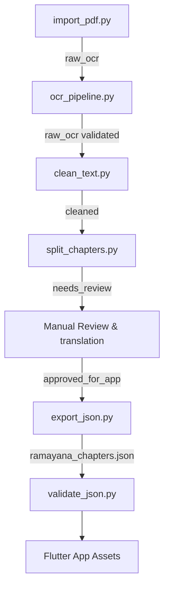

# SitaRam Content Import Pipeline

This directory contains scripts and tools for preparing, cleaning, translating, and validating the Valmiki Ramayana chapters for the SitaRam mobile application.

## Pipeline Workflow

The import process transitions content through several stages, ensuring that raw OCR mistakes are cleaned and verified by editors before publication.



### Review Statuses
1. `raw_ocr`: The text has just been extracted from the PDF pages or images.
2. `cleaned`: Running headers, page numbers, and formatting artifacts have been stripped.
3. `needs_review` / `needs_native_review` (Bangla): Text is split into chapters but has not been checked by a reviewer.
4. `reviewed`: Checked by a reviewer for typos and readability.
5. `approved_for_app`: Fully approved and ready to be compiled into the final release bundle.

---

## How to Run the Pipeline

### Step 1: Import the PDF
Extracts text from a specified PDF, or bootstraps with pre-made samples if no PDF is provided.
```bash
# To bootstrap samples:
python3 import_pdf.py

# To process a specific PDF (requires pypdf: pip install pypdf):
python3 import_pdf.py --pdf /path/to/ramayana.pdf
```
*Output: Page JSON files in `data/pages/page_XXX.json`*

### Step 2: Validate OCR Extraction
Ensures all pages have text and makes basic OCR spell corrections.
```bash
python3 ocr_pipeline.py
```

### Step 3: Run Text Cleaner
Strips out page headers (e.g. "VALMIKI RAMAYANA", "BALA KANDA"), page numbers, and extra spacing.
```bash
python3 clean_text.py
```
*Transitions page status from `raw_ocr` to `cleaned`.*

### Step 4: Split into Chapters
Aggregates all `cleaned` pages and splits them into individual chapter JSON files. This also creates corresponding Bangla translation templates.
```bash
python3 split_chapters.py
```
*Output: Chapters in `data/chapters/en_...json` and `bn_...json`.*

### Step 5: Manual Review & Bangla Translation
Before compiling, open the files in `data/chapters/` to review, add translations, and change statuses.
- **English files (`en_*.json`)**: Edit `"text"`, `"summary"`, `"moral_lesson"`, `"characters"`, `"themes"`. Update `"review_status"` to `"approved_for_app"`. Fill in `"reviewer_name"` and `"approval_date"` inside `"source_metadata"`.
- **Bangla files (`bn_*.json`)**: Edit `"chapter_title_bn"`, `"bangla_summary"`, and `"bangla_explanation"`. Update `"review_status"` to `"approved_for_app"`.

### Step 6: Export & Merge Chapters
Merges English chapters and Bangla translations together, creates audiobook player metadata, and writes the output file to the Flutter app's assets directory.
```bash
# In development (exports all pages regardless of status):
python3 export_json.py

# In release mode (exports only approved chapters):
python3 export_json.py --release
```

### Step 7: Validate Schema
Verifies that the compiled file satisfies the app's internal schema requirements.
```bash
python3 validate_json.py
```

---

## How to Add Audiobook Files
Audiobooks are defined in the chapter metadata. The app expects MP3 audio files in the assets folders:
- English narrations: `assets/audio/en/<chapter_id>.mp3`
- Bangla explanations: `assets/audio/bn/<chapter_id>.mp3`

To update audiobook metadata (e.g., setting actual `duration` and changing `"status"` from `"placeholder"` to `"ready"`):
1. Open the compiled `export_json.py` or directly update the exporter script.
2. The app's reader page will automatically show the media player controls and load the audio tracks when they are marked `"ready"`.
